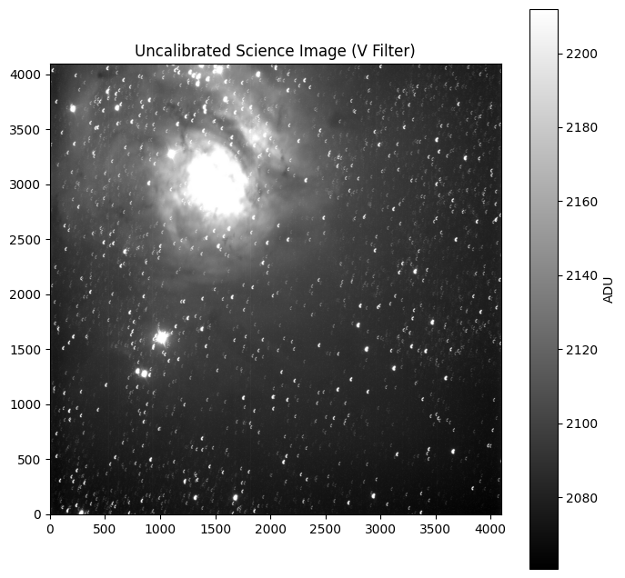
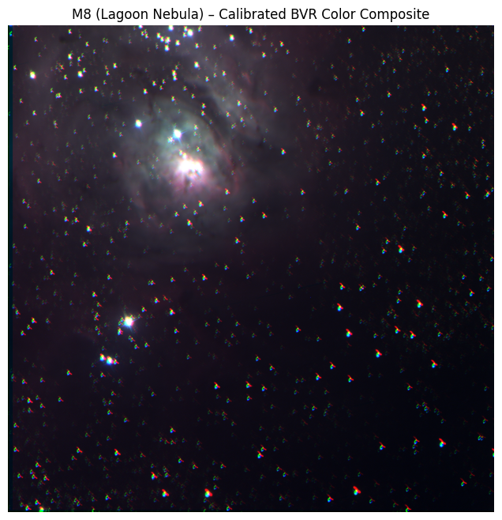

# Thunderbird South Image Processing
This repository contains data M8(Lagoon Nebula) from UBC's Thunderbird South Telescope and a JupyterLab file with code to process this data. Learn more about
UBC's Thunderbird South <a target="_blank" href="https://thunderbirdsouth.phas.ubc.ca/">here</a>.

This repo also includes the complete solution code for the workshop, which includes code that is run to precalibrate the fits data from the telescope

This code was developed both for the purposes of my own learning and teaching the process of image calibration and telescope data processing to get 
the pictures of deep space we all like seeing

---

## Workshop Overview

Astronomical images don’t start out beautiful — they’re full of noise, hot pixels, uneven lighting, and instrumental effects.  
To make sense of them, astronomers use a process called **CCD calibration** to clean and standardize the data before combining and visualizing it.

In this workshop, you’ll:
1. Understand the role of **dark**, **flat**, and **science** frames  
2. Use **Python and Astropy** to calibrate raw telescope data  
3. Create **master calibration frames** (master dark and master flat)  
4. Apply calibration to science exposures
6. Assemble a **color composite image (BVR)** of the Lagoon Nebula (M8)

---

## Intended Learning Outcomes of the Workshop

| Concept | Description |
|----------|--------------|
| **Dark Frames** | Measure thermal noise from the camera and remove it from science images. |
| **Flat Frames** | Correct for uneven illumination and dust on optics. |
| **Science Frames** | The real observations - what we actually want to study! |
| **Sigma Clipping** | Removes outlier pixels (e.g, cosmic rays, satellite trails). |
| **BVR Color Composition** | Combine separate Blue, Visual (Green), and Red filters to form a realistic color image. |

---
## Setup

### Cloning the Repo

There are big files in this repo. To clone this repo, you need to import git large file storage(lfs).
Run the following code in your terminal
based on your operating system

<u> On MacOS </u>
```
brew install git-lfs
```

<u> On Windows:
Download from git-lfs.github.com or use: </u>
```
winget install git-lfs
```

<u>On Linux:</u>
```
sudo apt-get install git-lfs
```

### Getting Started (Google Colab Setup)

1. **Open the Colab Notebook**
   - Upload or open this folder to your Google Drive.

2. **Mount Google Drive**
   - The dataset should already be in your drive now.
   - Run the first code cell:
     ```python
     from google.colab import drive
     drive.mount('/content/drive')
     ```

3. **Update Your Path**
   - Modify the `path` variable to point to your data folder:
     ```python
     path = "/content/drive/MyDrive/Colab Notebooks/Thunderbird South Coding Workshop Data/M8_data"
     ```

4. **Run Each Section**
   - Follow the notebook in order.
   - Sections with `# TODO` are your exercises — try completing them before checking the hints.
   - Expand the collapsible **💡 Hints** under each TODO for help.

---

## Result

Thunderbird South collects CCD (charge-coupled device) data using an array of light-sensitive pixels to capture photons, which are converted into an electrical charge.
So the actual data we get is a measure of photon intensity per pixel. This gives us a single value per pixel, which we can use to generate a  greyscale image. In the workshop,
you see exactly how we process the data. The greyscale for the visual(V) filter looks as follows:



However, we are all used to seeing those colorful pictures of outer space. If telescopes only collect data for greyscale images, then how do we get those colored ones?
We use different filters! If we use a red filter with out telescope, the telescope only records the higher wavelengths of light (red light). Similar filters can be applied to get a
measure of how much green and blue light there is. If we layer this data on top of each other and stack them together, we can get an RGB(color) composite. In the workshop,
you see exactly how we stack calibrated BVR filter data to get a color composite. The color image looks as follows:



